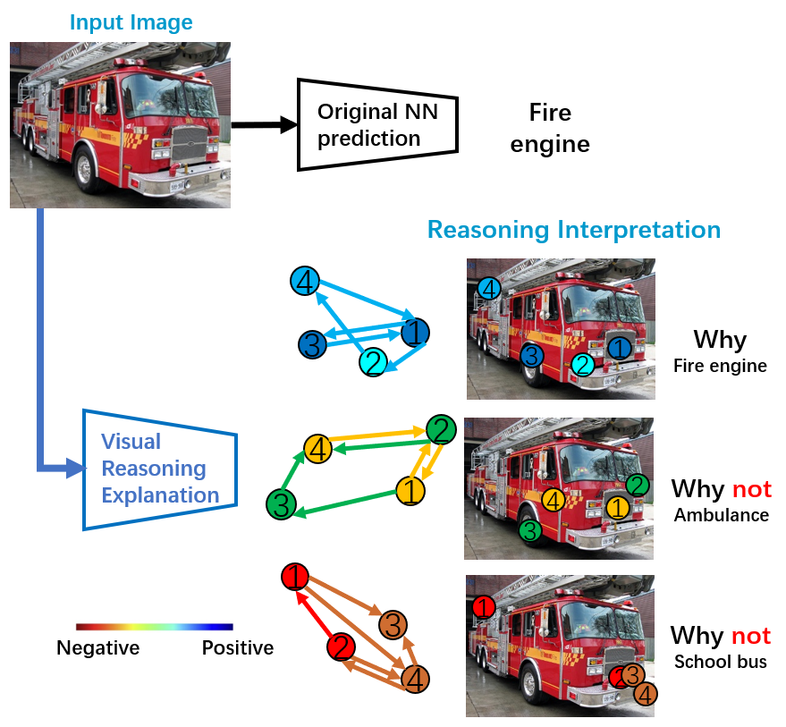
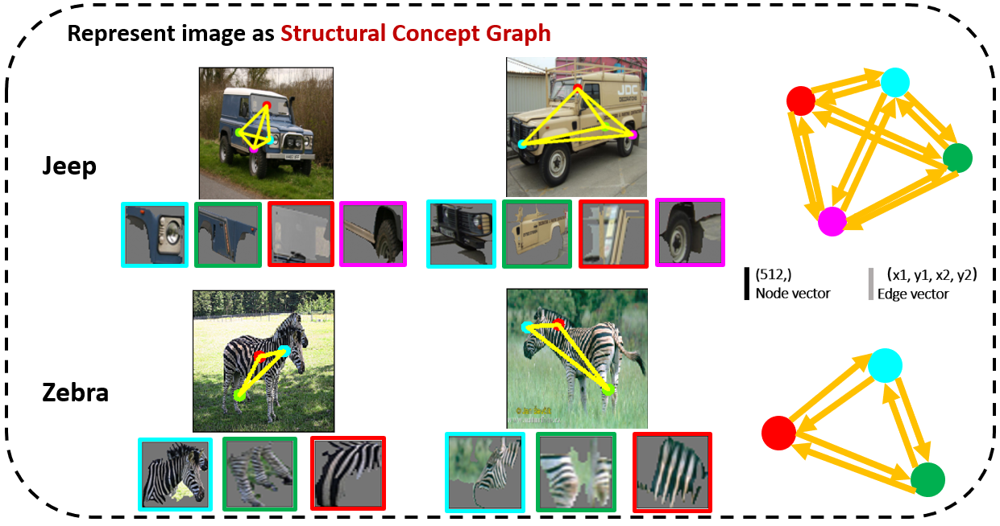
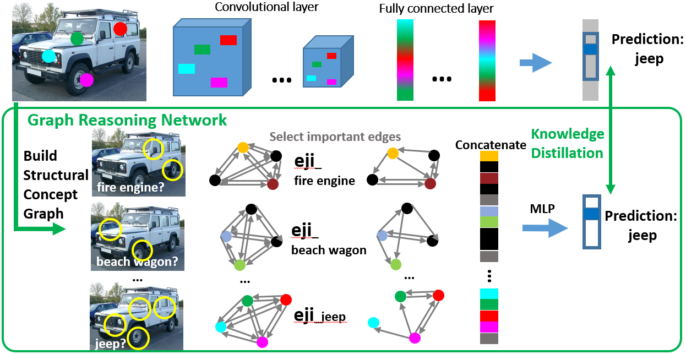

# Visual-Reasoning-eXplanation

[CVPR 2021 A Peek Into the Reasoning of Neural Networks: Interpreting with Structural Visual Concepts] 

### [Project Page](http://ilab.usc.edu/andy/vrx) | [Video](https://youtu.be/ZzkpUrK-cRA) | [Paper](https://openaccess.thecvf.com/content/CVPR2021/papers/Ge_A_Peek_Into_the_Reasoning_of_Neural_Networks_Interpreting_With_CVPR_2021_paper.pdf)
<div align="center">
    
</div>

**Figure:** *An example result with the proposed VRX. To explain the prediction (i.e., fire engine and not alternatives like ambulance), VRX provides both visual and structural clues.*

> **A Peek Into the Reasoning of Neural Networks: Interpreting with Structural Visual Concepts** <br>
> Yunhao Ge,  Yao Xiao, Zhi Xu, Meng Zheng, Srikrishna Karanam, Terrence Chen, Laurent Itti, Ziyan Wu <br>
> *IEEE/ CVF International Conference on Computer Vision and Pattern Recognition (CVPR), 2021*


We considered the challenging problem of interpreting the reasoning logic of a neural network decision. We propose a novel framework to interpret neural networks which extracts relevant class-specific visual concepts and organizes them using structural concepts graphs based on pairwise concept relationships. By means of knowledge distillation, we show VRX can take a step towards mimicking the reasoning process of NNs and provide logical, concept-level explanations for final model decisions. With extensive experiments, we empirically show VRX can meaningfully answer “why” and “why not” questions about the prediction, providing easy-to-understand insights about the reasoning process. We also show that these insights can potentially provide guidance on improving NN’s performance.

<div align="center">
    
</div>

**Figure:** *Examples of representing images as structural concept graph.*

<div align="center">
    
</div>

**Figure:** *Pipeline for Visual Reasoning Explanation framework.*

## Getting Started

### Installation

- Clone this repo:
```bash
git clone https://github.com/gyhandy/Visual-Reasoning-eXplanation.git
cd Visual-Reasoning-eXplanation
```

- Dependencies
```
pip install -r requirements.txt
```
<br>


### Datasets
- We use a subset of ImageNet as our source data. There are intrested classes which want to do reasoning, such as fire angine, ambulance and school bus, and also other random images for discovering concepts. You can download the source data that we used in our paper here: [source](http://ilab.usc.edu/andy/dataset/source.zip) [http://ilab.usc.edu/andy/dataset/source.zip]

- Input files for training GNN and doing reasoning. You can get these data by doing discover concepts and match concepts yourself, but we also provide those files to help you doing inference directly. You can download the result data here: [result](http://ilab.usc.edu/andy/dataset/result.zip)[http://ilab.usc.edu/andy/dataset/result.zip]

### Datasets Preprocess

Unzip source.zip as well as result.zip, and then place them in `./source` and `./result`

### Discover concept
For more information about discover concept, you can refer to [ACE: Towards Automatic Concept Based Explanations](https://github.com/amiratag/ACE?utm_source=catalyzex.com).
We use the pretrained model provided by tensorflow to discover cencept. With default setting you can simply run 
```bash
python3 discover_concept.py
```

If you want to do this step with a custom model, you should write a wrapper for it containing the following methods: 
```bash
run_examples(images, BOTTLENECK_LAYER): which basically returens the activations of the images in the BOTTLENECK_LAYER. 'images' are original images without preprocessing (float between 0 and 1)
get_image_shape(): returns the shape of the model's input
label_to_id(CLASS_NAME): returns the id of the given class name.
get_gradient(activations, CLASS_ID, BOTTLENECK_LAYER): computes the gradient of the CLASS_ID logit in the logit layer with respect to activations in the BOTTLENECK_LAYER.
```
If you want to discover concept with GradCam, please also implement a 'gradcam.py' for your model and place it into `./src`. Then run:
```bash
python3 discover_concept.py --model_to_run YOUR_LOCAL_PRETRAINED_MODEL_NAME --model_path YOUR_LOCAL_PATH_OF_PRETRAINED_MODEL --labels_path LABEL_PATH_OF_YOUR_MODEL_LABEL --use_gradcam TRUE/FALSE
```

### Match concept
This step will use the concepts you discovered in last step to match new images. If you want to match your own images, please put them into `./source` and create a new folder named `IMAGE_CLASS_NAME`. Then run:
```bash
python3 macth_concept.py --model_to_run YOUR_LOCAL_PRETRAINED_MODEL_NAME --model_path YOUR_LOCAL_PATH_OF_PRETRAINED_MODEL --labels_path LABEL_PATH_OF_YOUR_MODEL_LABEL --use_gradcam TRUE/FALSE
```

### Training Structural Concept Graph (SCG)
```bash
python3 VR_training_XAI.py
```
Then you can find the checkpoints of model in `./result/model`.

### Reasoning a image
For images you want to do reasoning, you should first doing `match concept` to extract concept knowledge. Once extracted graph knowledge for SCG, you can do the inference. For example, if you want to inference `./source/fire_engine/n03345487_19835.JPEG`, the "img_class" is "ambulance" and "img_idx" is 10367, then run:
```bash
python3 Xception_WhyNot.py --img_class fire_engine --img_idx 19835
```

<b>We will post other relevant resources, implementations, applications and extensions of this work here. Please stay tuned</b>


